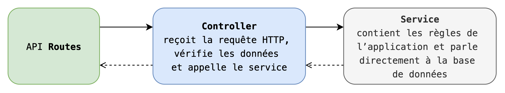

## Architecture de CineNote

Le projet **CineNote** est un **monolithe**.
Toutes les parties (authentification, gestion des films, gestion des utilisateurs, watchlist) sont regroupées dans une seule application.

C’est adapté parce que :

* le projet est développé par une seule personne,
* les besoins sont simples et ne justifient pas une architecture complexe.

## 🎨 Patterns utilisés

* **MVC (Model – View – Controller)**
  → séparer la logique métier (Controller/Service), la base de données (Model) et l’interface (Next.js).

* **Service Layer**
  → mettre les règles dans des services réutilisables, séparés des contrôleurs.

* **Middleware**
  → intercepte les requêtes pour vérifier le token JWT ou gérer les droits d’accès.

## 📐 Découpage en couches

## 🔎 Rôle des couches

* **Controller**

  * reçoit la requête HTTP
  * vérifie les données reçues
  * appelle le service adapté
  * renvoie la réponse

* **Service**

  * applique les règles de l’application (exemple : éviter les doublons dans la watchlist)
  * communique avec la base via Knex
  * fournit des fonctions réutilisables (`getCinephileById`, `createMovie`, etc.)

---

## ⚙️ Choix techniques

* **Monolithe** : plus simple à développer et à maintenir pour un projet individuel.
* **Next.js (frontend)** : framework moderne et efficace pour l’affichage côté client.
* **Hono (backend)** : léger, rapide et adapté à la création d’API.
* **PostgreSQL** : base de données fiable, adaptée pour gérer des relations (utilisateurs, films, watchlist).
* **JWT** : authentification sans état, simple à utiliser avec une API REST.
* **Knex.js** : facilite l’écriture des requêtes SQL tout en restant proche du langage SQL.