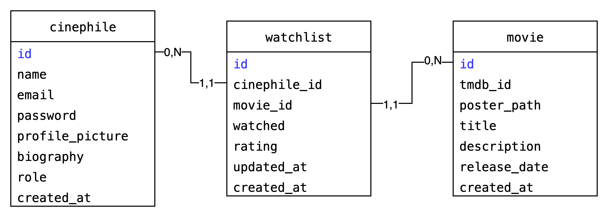

# DATABASE.md – Architecture base de données

## 📐 Modèle Conceptuel de Données



## 🗂️ Entités et champs

### 🎭 Cinephile

| Champ            | Type         | Contraintes                          |
| ---------------- | ------------ | ------------------------------------ |
| id               | SERIAL       | PK, auto-incrément                   |
| name             | VARCHAR(100) | NOT NULL                             |
| email            | VARCHAR(100) | UNIQUE, NOT NULL                     |
| password         | VARCHAR(255) | NOT NULL                             |
| profile\_picture | VARCHAR(255) | optionnel                            |
| biography        | TEXT         | optionnel                            |
| role             | VARCHAR(50)  | `user` ou `admin`, par défaut `user` |
| created\_at      | TIMESTAMP    | par défaut `NOW()`                   |

---

### 🎬 Movie

| Champ         | Type         | Contraintes              |
| ------------- | ------------ | ------------------------ |
| id            | SERIAL       | PK, auto-incrément       |
| tmdb\_id      | VARCHAR(255) | identifiant du film de l'API TMDB |
| poster\_path  | VARCHAR(255) | optionnel (affiche)      |
| title         | VARCHAR(255) | NOT NULL                 |
| description   | TEXT         | optionnel                |
| release\_date | DATE         | optionnel                |
| created\_at   | TIMESTAMP    | par défaut `NOW()`       |

---

### 📜 Watchlist

| Champ         | Type      | Contraintes                                    |
| ------------- | --------- | ---------------------------------------------- |
| id            | SERIAL    | PK, auto-incrément                             |
| cinephile\_id | INT       | FK → `cinephile(id)`, NOT NULL, CASCADE DELETE |
| movie\_id     | INT       | FK → `movie(id)`, NOT NULL, CASCADE DELETE     |
| watched       | BOOLEAN   | par défaut `FALSE`                             |
| rating        | INT       | optionnel, entre 1 et 5                        |
| updated\_at   | TIMESTAMP | optionnel                                      |
| created\_at   | TIMESTAMP | par défaut `NOW()`                             |

---

## 📝 Exemples JSON

### Exemple d’un utilisateur (*cinephile*)

```json
{
  "id": 1,
  "name": "Fafa",
  "email": "fafa@example.com",
  "profile_picture": "https://cdn.cinenote.com/profiles/fafa.png",
  "biography": "Passionnée de cinéma depuis toujours",
  "role": "user",
  "created_at": "2025-09-03T12:34:56Z"
}
```

### Exemple d’un film

```json
{
  "id": 101,
  "tmdb_id": "550",
  "poster_path": "/a26cQPRhJPX6GbWfQbvZdrrp9j9.jpg",
  "title": "Fight Club",
  "description": "Un employé de bureau insomniaque rencontre un vendeur de savon charismatique...",
  "release_date": "1999-10-15",
  "created_at": "2025-09-03T12:35:00Z"
}
```

### Exemple d’un élément de watchlist

```json
{
  "id": 201,
  "cinephile_id": 1,
  "movie_id": 101,
  "watched": true,
  "rating": 5,
  "updated_at": "2025-09-03T15:20:00Z",
  "created_at": "2025-09-03T12:36:00Z"
}
```
